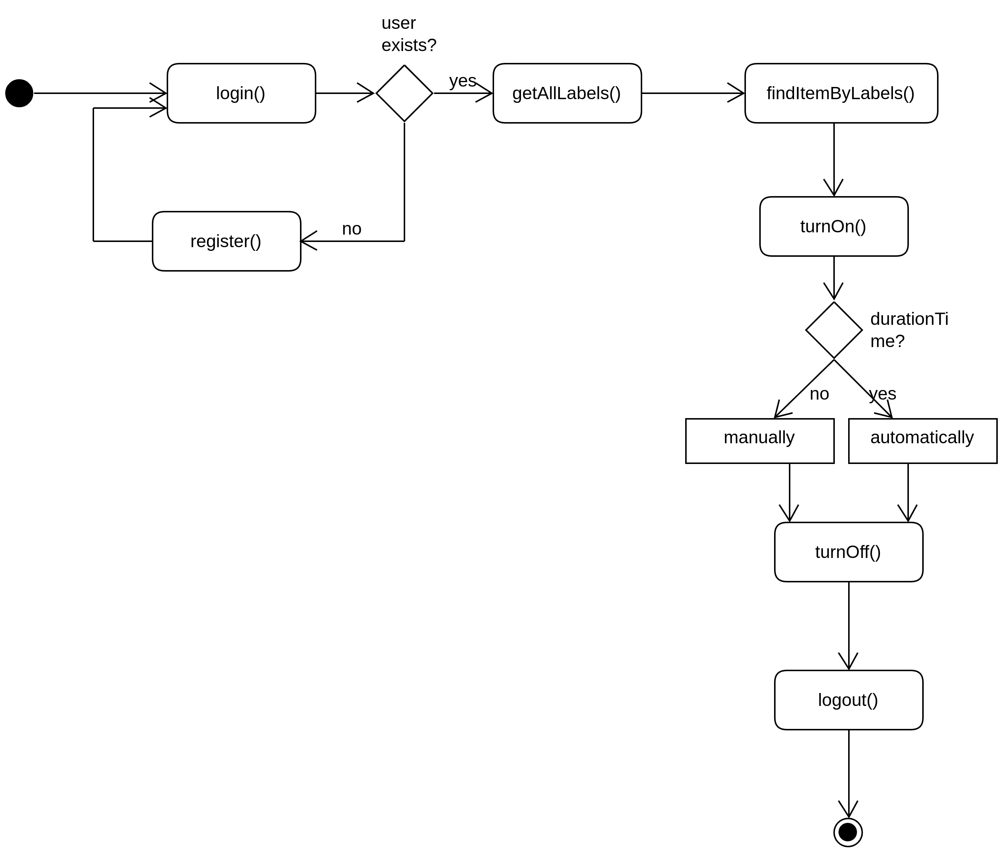
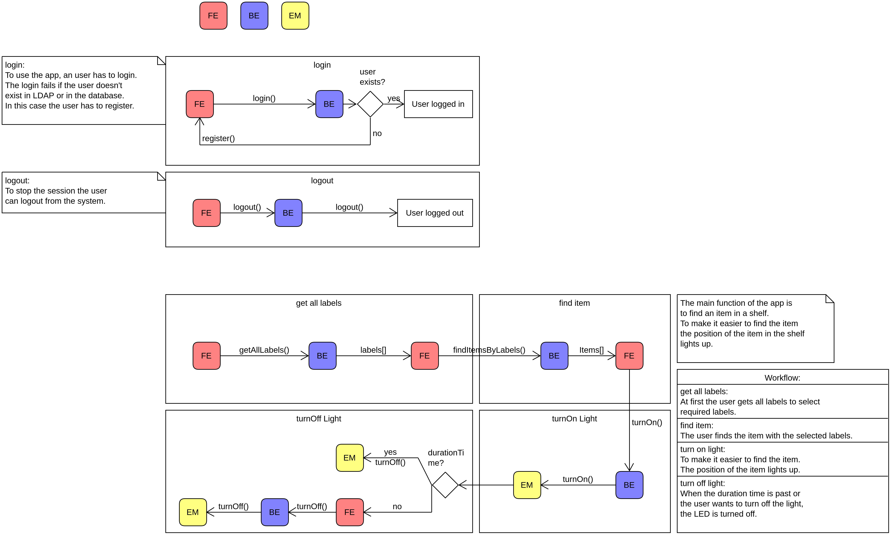

# Process diagrams

This file documents the process of finding an item in the Pick-By-Light-System.

The first diagram shows the order in which the different functions are called.
It includes the authentication progress (`login`/`logout`) and documents the necessary API calls to turn on the lights belonging to the respective items.
After the `turnOn` function call, a duration time can be passed, after which the lights are turned off automatically.

The second diagram displays the same process but focuses on the different components (frontend, backend, embedded system).
    

The diagrams were made with the application [UMLet](https://www.umlet.com/).
